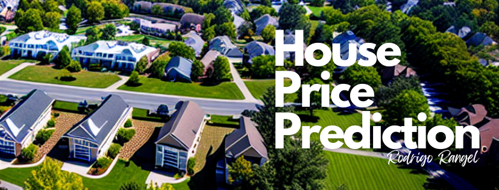
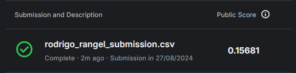

<h1>
<b>House Price Prediction (Pricing Problem)</b>
</h1>

> **Status**: *Em progresso* ⚠️

# 1 - Objetivos do Projeto

O principal objetivo deste projeto é <u>treinar e demonstrar o meu conhecimento sobre modelos supervisionados de regressão</u>. Por esse motivo, me inscrevi em um famoso concurso do Kaggle para aplicar técnicas avançadas de regressão para prever os preços de residencias através de um conjunto de dados da cidade de Ames, Iowa (EUA).

Para avaliação da solução do problema proposto, o concurso exigiu que seja submetido um dataframe com os valores dos preços dos imóveis preditos pelos dados de teste, que foram avaliados em *Root-Mean-Squared-Log-Error (RMSLE)*. 

# 2 - Etapas do Desenvolvimento do Modelo

Meus passos estratégicos para desenvolver o modelo:

1) **Descrição e Manipulação de Dados**: Nesta etapa, busquei entender e validar os dados brutos para análise. Aqui, identifiquei inconsistências em variáveis que possuem associação com outras, através da análise de valores zerados e ausentes. Tratei os valores incosistentes através da criação e regras de imputação de dados definidas pelas associações das variáveis problematicas.

2) **Análise Exploratória de Dados**: Na Análise Exploratória de Dados busquei explorar e resumir os principais aspectos dos dados através de visualizações personalizadas. Também tratei outliers super extremos.

3) **Seleção de Features**: Aqui, identifiquei as variáveis mais relevantes para o modelo através do algoritmo SelectKBest pelo método de Informação Mútua.

4) **Modelagem Preditiva**: Criei, otimizei e avaliei 4 tipos de modelos de Machine Learning. Por fim, escolhi como modelo final o XGBoost que me forneceu um valor de RMSLE de 0.143 +/- 0.020 na validação cruzada. Para modelagem, criei pipelined de transformações dos dados, para que as etapas de otimização e avaliação não sofressem vazamento de informações.

 

# 3 - Performance do Modelo
Após a, o *RMSLE* atingiu o valor de **0.15681**, aproximando muito do desempenho esperado e apresentado pelos modelos desenvolvidos neste projeto, principalmente o modelo final.

# 4 - Lições Aprendidas

- **Visualizações personalizadas não são apenas estéticas, mas essenciais para insights profundos**. Personalizar gráficos durante a análise exploratória pode revelar padrões que passam despercebidos em abordagens padrão.

- **Pipelines bem estruturados são a chave para manter a integridade dos dados**. Garantir que não haja vazamento de dados em todas as etapas, especialmente durante a validação cruzada, é crucial para obter uma avaliação precisa do modelo.

- **A fidelidade na validação é um reflexo direto da performance real**. Uma validação bem conduzida com dados não vazados oferece uma visão clara do desempenho futuro da solução, permitindo ajustes precisos antes da submissão final.

 

Para acessar as versões do projeto, acesse a pasta <u>notebooks</u>.

Obrigado!

Rodrigo Rangel

