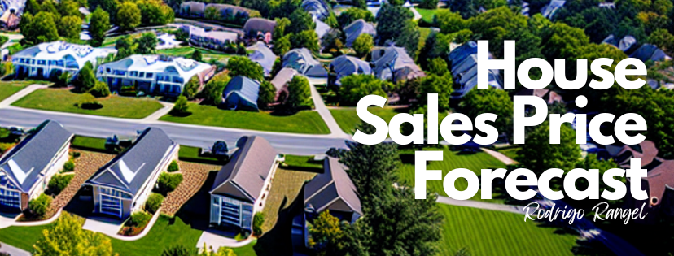
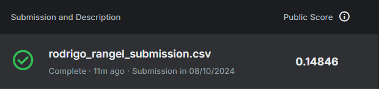

<h1><p align= "center"><b>House Sales Price Forecast (Pricing Problem)</b></p></h1>

<p align= "center">
<a href="https://www.kaggle.com/competitions/house-prices-advanced-regression-techniques"></a>
</p>

> **Status**: *Concluído* ✅

<h2 align= "center"><p><a href= "https://nbviewer.org/github/rodrigo-rngl/data-science-portfolio/blob/master/projects/house-sales-price-forecast/notebooks/House%20Sales%20Price%20Forecast%20%28pt-br%29.ipynb"><u>Clique aqui para visualizar o projeto!</u></a></p></h2> 

<div style= "margin: 40px;"></div>

# Objetivos do Projeto

O principal objetivo deste projeto é <u>treinar e demonstrar o meu conhecimento sobre modelos supervisionados de regressão</u>. Por esse motivo, me inscrevi em um famoso concurso do Kaggle para aplicar técnicas avançadas de regressão para prever os preços de residenciais através de um conjunto de dados da cidade de Ames, Iowa (EUA).

Para avaliação da solução do problema proposto, o concurso exigiu que seja submetido um dataframe com os valores dos preços dos imóveis preditos pelos dados de teste, que foram avaliados em *Root-Mean-Squared-Log-Error (RMSLE)*.

Após o treinamento e escolha do modelo, contruí uma **API Flask** para disponibilizar o resultado da previsão.

<div style= "margin: 20px;"></div>

# Etapas do Desenvolvimento do Modelo

Meus passos estratégicos para desenvolver o modelo:

1) **Descrição e Manipulação de Dados**: Nesta etapa, busquei entender e validar os dados brutos para análise. Aqui, identifiquei inconsistências em variáveis que possuem associação com outras, através da análise de valores zerados e ausentes. Tratei os valores incosistentes através da criação e regras de imputação de dados definidas pelas associações das variáveis problemáticas.

2) **Análise Exploratória de Dados**: Na Análise Exploratória de Dados busquei explorar e resumir os principais aspectos dos dados através de visualizações personalizadas. Também tratei outliers super extremos.

3) **Seleção de Features**: Aqui, identifiquei as variáveis mais relevantes para o modelo através do algoritmo SelectKBest pelo método de Informação Mútua.

4) **Modelagem Preditiva**: Criei, otimizei e avaliei 4 tipos de modelos de Machine Learning. Por fim, escolhi como modelo final o XGBoost que me forneceu um valor de RMSLE de 0.138 +/- 0.020 na validação cruzada. Também na modelagem, criei pipelines de transformações para que as etapas de otimização e validação não sofressem vazamento de dados.

 
<div style= "margin: 20px;"></div>

# Performance do Modelo
Na submissão, o *RMSLE* atingiu o valor de **0.14846**, aproximando muito do desempenho esperado e apresentado pelos modelos desenvolvidos neste projeto, principalmente o modelo final.

<p align= "center">
<a></a>
</p>

<div style= "margin: 20px;"></div>

# Instruções para executar a API Flask e testar localmente
## 1. Clonar o repositório
Abra o terminal e execute o seguinte comando para clonar o repositório do GitHub:

```bash
git clone https://github.com/seu-usuario/seu-repositorio.git
```
Substitua `https://github.com/seu-usuario/seu-repositorio.git` pelo URL real do seu repositório.

Após clonar o repositório, navegue até o diretório do projeto:

```bash
cd seu-repositorio
```

## 2. Instalar as dependências
Instale as bibliotecas necessárias executando o comando:

```bash
pip install -r requirements.txt
```

## 3. Executar o servidor Flask
Execute o servidor Flask localmente:

```bash
python flask-api/app.py
```
Se o projeto está configurado corretamente, o servidor Flask será iniciado, e você verá uma mensagem indicando que ele está rodando em `http://127.0.0.1:5000`.

## 4. Testar a API
Para testar o funcionamento da API, utilize o script `tester.py`. Certifique-se de que o servidor está rodando antes de executar o teste.

No terminal, execute o seguinte comando:

```bash
python flask-api/tester.py
```
O script enviará uma solicitação para o endpoint `/predict` e exibirá a resposta no terminal.

# Estrutura de Pastas do Projeto

O projeto segue a seguinte estrutura:
```
house-sales-price-forecast/
├── data/
│   ├── extracted_data/                     # Dados extraídos
│   ├── house-prices-advanced-regression-techniques.csv
│   └── rodrigo_rangel_submission.csv       # Dados da previsão do modelo criado para submissão do desafio do Kaggle
├── flask-api/
│   ├── data/
│   │   └── xgboost_model.pkl               # Serialização do modelo treinado no projeto
│   ├── models/
│   │   └── model_handler.py                # Manipulação do modelo
│   ├── app.py                              # Script principal da API Flask
│   ├── config.py                           # Configuração da API Flask
│   └── tester.py                           # Script para testar a API localmente
├── img/                                    # Imagens do projeto
├── notebooks/
│   └── House Sales Price Forecast (pt-br).ipynb   # Notebook principal do projeto (análises e modelagem)
├── .env                                    # Variáveis de ambiente
├── .python-version                         # Versão Python configurada
├── README.md                               # Documentação do projeto
├── requirements.txt                        # Arquivo de dependências

```

# Lições Aprendidas

- **Visualizações personalizadas não são apenas estéticas, mas essenciais para insights profundos**. Personalizar gráficos durante a análise exploratória pode revelar padrões que passam despercebidos em abordagens padrão.

- **Pipelines bem estruturados são a chave para manter a integridade dos dados**. Garantir que não haja vazamento de dados em todas as etapas, especialmente durante a validação cruzada, é crucial para obter uma avaliação precisa do modelo.

- **A fidelidade na validação é um reflexo direto da performance real**. Uma validação bem conduzida com dados não vazados oferece uma visão clara do desempenho futuro da solução, permitindo ajustes precisos antes da submissão final.

<div style= "margin: 20px;"></div>

#  Referências

GÉRON, Aurélion. **Mãos à Obra: Aprendizado de Máquina com Scikit-Learn, Keras & TensorFlow: Conceitos, Ferramentas e Técnicas Para a Construção de Sistemas Inteligentes**. Alta Books, 2021

BROWNLEE, Jason. **Scikit-Optimize for Hyperparameter Tuning in Machine Learning**. Disponível em: <https://machinelearningmastery.com/scikit-optimize-for-hyperparameter-tuning-in-machine-learning/>. Acesso em: 05/09/2024

<hr></hr>
<div style= "margin: 20px;"></div>

<p align= "center">Para acessar as versões do projeto, acesse a pasta <a href= "https://github.com/rodrigo-rngl/data-science-portfolio/tree/master/projects/house-sales-price-forecast/notebooks">notebooks</a>.</p>
<p align= "center">Obrigado!</p>
